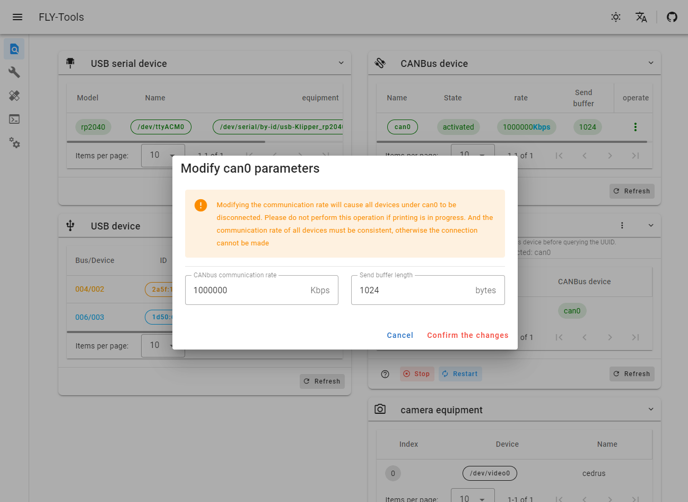
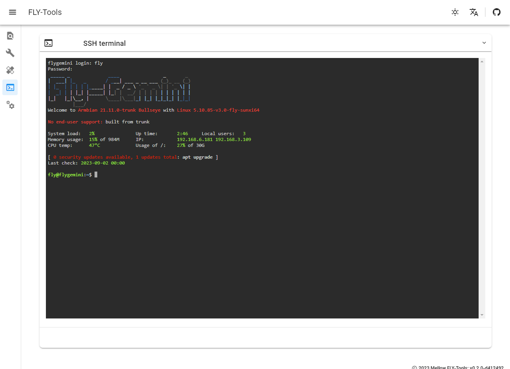
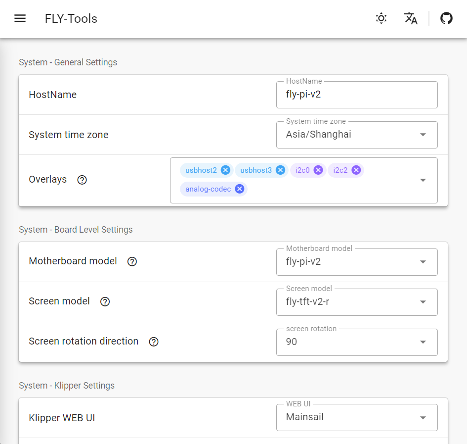

# FLY-Tools

[English](./README.md)

**注意：FLY-Tools可以通过系统中的klipper.service自动获取klipper目录。 如果自动获取失败，请手动添加配置文件。**

**注意：不支持旧版本的klipper，请务必使用最新版本的klipper。**

**注意：Katapult固件编译正在适配更多主板型号**

## Fly-Tools介绍

* Fly-Tools是一个用于提升Klipper用户操作体验的WEB工具
    
1. 特性

    * 多语言支持，暗色主题支持
    * 支持查询并复制USB串口ID，USB设备ID，CANbus UUID，Video设备ID
    * 支持一键启用或禁用指定是CAN设备
    * 支持在线修改CAN设备的速率及发送缓冲区大小
    * 支持在线编译FLY主板的klipper固件(Katapult固件编译正在适配)
    * 支持在线烧录，支持DFU,HID,CAN等烧录方式
    * 支持下载所有已编译的固件文件
    * 支持在线生成Klipper负载图
    * 支持一键自动测量并生成共振图
    * 支持WEB网页SSH(基于[ttyd](https://github.com/tsl0922/ttyd))
    * 在线修改部分系统设置(只支持FLYOS)

2. 效果图

    <table>
    <tr>
    <td></td>
    <td></td>
    </tr>
    <tr>
    <td></td>
    <td></td>
    </tr>
    <tr>
    <td></td>
    <td></td>
    </tr>
    <tr>
    <td></td>
    <td></td>
    </tr>
    </table>
    

## 安装Fly-Tools

1. 拉取最新版本Klipper

    ```
    cd ~/klipper
    git pull
    ```
    
    * 如果您修改过本地klipper源码导致拉取失败，请使用以下命令。 （此操作将丢弃您之前修改过的文件）
  
    ```
    cd ~/klipper
    git checkout .
    git pull
    ```

2. 拉取最新的Katapult(原Canboot)

    ```
    cd ~/
    git clone https://github.com/Arksine/katapult
    ```

3. 安装Fly-Tools服务

    * 安装过程依赖Github服务，如果安装过程中长时间无响应，请按`Ctrl + C`退出安装脚本并重试

    ```
    curl -kfsSL https://raw.githubusercontent.com/kluoyun/FLY-Tools/main/scripts/install.sh | sudo bash
    ```

4. 打开浏览器

    * 默认端口9999
    * `http://{你的设备IP}:9999/`

## 使用配置文件

* 没有配置文件时默认自动获取参数

1. Fly-Tools配置文件

    * 可以通过修改`/etc/systemd/system/Fly-Tools.service`文件来使用配置文件
    * 将`ExecStart=/usr/local/bin/Fly-Tools`修改为`ExecStart=/usr/local/bin/Fly-Tools -c /path/fly-tools.conf`
    * 重启服务
        ```
        sudo systemctl daemon-reload
        sudo systemctl restart Fly-Tools.service
        ```

2. 示例配置

    * fly-tools.conf
        ```ini
        [app]
        port: 9999        # FlyTools服务监听的端口，留空默认9999
        ttyd_port: 9998   # 网页SSH的ttyd服务端口，留空默认9998

        [printer]
        user: fly                                        # 安装了Klipper的用户名，留空自动识别
        klipper_sock: /home/fly/printer_data/comms/klippy.sock # Klipper的Unix套接字网络
        klipper_dir: /home/fly/klipper                   # Klipper仓库目录，留空自动识别
        katapult_dir: /home/fly/katapult                 # Katapult仓库目录，留空自动识别
        logs_dir: /home/fly/printer_data/logs            # Klipper等服务的日志文件目录，留空自动识别
        configs_dir: /home/fly/printer_data/configs      # Klipper等服务的配置文件目录，留空自动识别

        [log]
        path:  # 日志存放路径，留空不保存到文件

        ```
      
## 自定义安装

* TODO

# 免责声明:

**感谢您使用我们的服务。 我们提供的信息和工具仅供参考，我们对其安全性、准确性或可靠性不做任何保证或承诺。 对于使用过程中因使用不当、网络故障等原因造成的任何损失或问题，我们不承担任何责任。 请谨慎使用并自行承担风险。**
